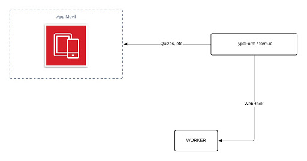
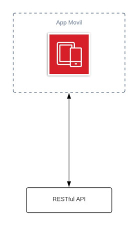
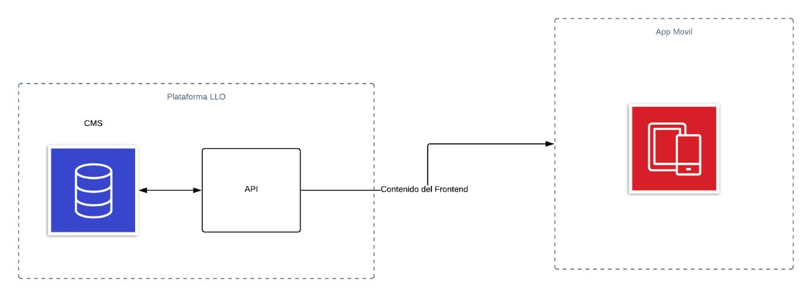
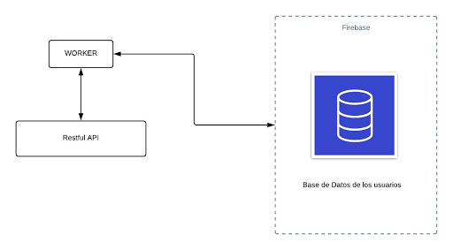

```{r setup, include=FALSE}
knitr::opts_chunk$set(echo = TRUE)
library(dplyr)
library(ggplot2)
library(caret)
```

## Introducción 
A través de los años las plataformas de aprendizaje en línea han logrado fortalecerse en el mercado, esto al ofrecer comodidades y otras ventajas que los cursos tradicionales no pueden brindar. Sin embargo, existe un aspecto importante en el que aún no pueden vencer a los cursos tradicionales y este es el alto número de deserciones. Este estudio se centra en analizar las características de los estudiantes desertores con el fin de identificar aquellos factores que llevan a un estudiantes a tomar la decisión de abandonar un curso. La información analizada fue brindada por la plataforma en línea Laureate Languages Online (LLO) de Laureate International Universities. Esta plataforma ofrece cursos de inglés al personal administrativo y docente de las instituciones que pertenecen a la red de universidades. La plataforma de LLO también se enfrenta a un alto porcentaje de deserciones dentro de sus cursos, tomando en cuenta que esto conlleva a una gran pérdida de recursos para la empresa, se reitera la importancia de encontrar esos factores que intervienen en el número de deserciones.

## Variables Capturadas
```{r read_dataset, echo=FALSE}
coursesData <- read.csv("CSV_DATASET.csv",header = T,sep = ",", encoding = "UTF-8")
```
Como se puede observar en la información brindadada se capturaron `r nrow(coursesData)` observaciones y `r length(names(coursesData))` columnas.
```{r str_dataset, echo=FALSE}
str(coursesData)
```

A continuación se muestra un breve resumen de cada una de nuestras columnas: 
```{r column_summary, echo=FALSE}
summary(coursesData)
```
## Tratamiento de Columnas
Para trabajar con datos realmente útiles y que no sean redundantes, se realizaron varios tipos de tratamientos. Entre ellos está el tratamiento de nombres de columnas, el tratamiento de valores nulos, el descarte de columnas y el descarte de registros.

### Tratamiento de Cambio de Nombres de Columnas
El primer tratamiento que se realizó fue cambiar los nombre de las columnas a uno más representativo. Además, se tradujeron los nombres del inglés al español. 

```{r column_names_change_code}
coursesDataVariablesNames <- names(coursesData)
df <- data.frame(column.name = coursesDataVariablesNames)
write.csv(df,"column_names.csv", row.names = FALSE)
coursesDataVariablesNames <- read.csv("column_names_treatment.csv",header = T,sep = ",", encoding = "UTF-8")
coursesDataVariablesNames$translation <- as.character(coursesDataVariablesNames$translation)
names(coursesData) <- coursesDataVariablesNames$translation
```
Al final quedaron los siguientes nombres de columnas.
```{r column_names_change_result, echo=FALSE}
names(coursesData)
```

### Descarte de Registros
Se tomó la decisión de eliminar los registros correspondientes al año 2020, ya que cuando se obtuvo la información de los cursos por parte de LLO, el primer lanzamiento de este año aún estaba en transcurso. Por lo tanto los registros correspondientes aún no contaban con un estado asignado ni una nota final. Por consiguiente, no contribuyen con información que sea útil para determinar si un estudiante decide desertar o no. Esto corresponde solamente a 10 registros. Posteriormente, después de añadir la columna de *ranking*, se descartaron los estudiantes que tenían asignada una institución que no pertenece al ranking de universidades, siendo 1224 registros eliminados. 
```{r}
coursesData <- coursesData[!(coursesData$año==2020),]
```


### Tratamiento de Valores Nulos e Imputaciones
Para detectar si se encontraban valores nulos o vacios dentro de la informacion, se calculo el porcentaje de nulos y vacios por cada columna. Los cuales se agregaron en una tabla que solamente muestra aquellas columnas que posee algun valor nulo o vacio.

```{r null_treatment, warning=FALSE}
na.summay <- c()
for (name in names(coursesData)) {
  s <- as.data.frame(prop.table(table(coursesData[,name] == "#N/A")))
  d <- as.data.frame(prop.table(table(coursesData[,name] == "")))
  extraccionVectorNa <- s %>% filter(Var1 == T) %>% select (Freq)
  extraccionVectorVa <- d %>% filter(Var1 == T) %>% select (Freq)
  
  DFTemporal <- data.frame(
    column_Name=c(name),
    column_NA_Percentage = ifelse(length(extraccionVectorNa$Freq) == 0, 0, extraccionVectorNa$Freq[1]),
    column_Empty_Percentage = ifelse(length(extraccionVectorVa$Freq) == 0, 0, extraccionVectorVa$Freq[1])
  )
  na.summay <- rbind(na.summay,DFTemporal)
}
```
Como se puede observar, solamente la columna de *notaFinal*, presentaba este tipo de valores.
```{r null_treatment_column_table, warning=FALSE}
na.summay %>% arrange(-column_NA_Percentage) %>% filter(column_NA_Percentage>0) %>% filter(column_Empty_Percentage>0)
```
Al estudiar un poco la información se noto que todas las notas finales que tenían una valor de NA eran de registros que tenían un estado de *"Dropout"* o *"No Show"*. 
```{r null_treatment_NA_table, warning=FALSE}
table(coursesData %>% filter(notaFinal=="#N/A") %>% select(estado))
```

Por lo cual se reemplazarón estos valores por una nota de 0, tomando en consideración que en estos estados, todos los demás registros que si tenian nota, contaban con esta nota.
```{r null_treatment_NA, warning=FALSE}
coursesData[coursesData$notaFinal == "#N/A","notaFinal"] <- "0"
```
En cuanto a los valores vacíos, se observó que el 3.8% de los registros se encuentran en el estado de *"Pass"* y no cuentan con una nota final. Los registros que se encontraban en el estado de *"Fail"* y que tiene esta misma condición representan el 7.8% de los registros. En cuanto a los registros que estan en *"No Show"* y que tambien tienen una nota vacía, representan el 2.4% de los registros. Finalmente, los registros que no tiene nota y estan en el estado de *"Dropout"* representan el 1.34% de los registros.
```{r null_treatment_empty_percentage, warning=FALSE}
null_percentage <- data.frame(table( coursesData %>% filter(notaFinal=="") %>% select(estado)))
null_percentage$totalPercentage <- as.numeric(as.character(null_percentage$Freq)) / 4776 *100
null_percentage
```
Se decidió asignarles como nota final a todos aquellos registros que tienen una nota vacia en el estado de *"Pass"*, el promedio de las notas de aquellos estudiantes que sí tienen una calificación asignada en el estado *“Pass”*. 

```{r null_treatment_empty_pass, warning=FALSE}
df.Pass <- coursesData %>% filter(estado=="Pass")
df.Pass <- df.Pass[!(df.Pass$notaFinal==""),]
df.Pass$notaFinal <- as.numeric(levels(df.Pass$notaFinal))[df.Pass$notaFinal]

meanRegistrosPro<- mean(df.Pass$notaFinal)
meanRegistrosPro<- format(round(meanRegistrosPro, 2), nsmall = 2)

DFTemporalPass<- coursesData %>% filter(estado=="Pass")
DFTemporalPass$notaFinal <- as.numeric(levels(DFTemporalPass$notaFinal))[DFTemporalPass$notaFinal]
DFTemporalPass[is.na(DFTemporalPass$notaFinal),"notaFinal"] <- meanRegistrosPro
table(DFTemporalPass[DFTemporalPass$notaFinal==meanRegistrosPro,"notaFinal"])

DFGeneralRows <- c()
DFGeneralRows <- rbind(DFGeneralRows,DFTemporalPass)
```

Asimismo, para los estudiantes en el estado *“Fail”* que no tenían una nota asignada, se les asignó el promedio de las calificaciones de aquellos que sí tienen un valor en su nota final y que se encuentran en un estado *“Fail”*.
```{r null_treatment_empty_fail, warning=FALSE}
df.fail <- coursesData %>% filter(estado=="Fail") 
df.fail <- df.fail[!(df.fail$notaFinal==""),]
df.fail$notaFinal <- as.numeric(levels(df.fail$notaFinal))[df.fail$notaFinal]
meanRegistrosFail<- mean(df.fail$notaFinal)
meanRegistrosFail<- format(round(meanRegistrosFail, 2), nsmall = 2)

DFTemporalFail<- coursesData %>% filter(estado=="Fail")
DFTemporalFail$notaFinal <- as.numeric(levels(DFTemporalFail$notaFinal))[DFTemporalFail$notaFinal]
DFTemporalFail[is.na(DFTemporalFail$notaFinal),"notaFinal"] <- meanRegistrosFail
table(DFTemporalFail[DFTemporalFail$notaFinal==meanRegistrosFail,"notaFinal"])

DFGeneralRows <- rbind(DFGeneralRows,DFTemporalFail)
```
 A los estados *"Dropout"* y *"No Show"* que tenían una nota vacía se les asignó la nota de 0, nuevamente tomando en consideración que el resto de registros en estos estados que si tienen nota cuentan con esa nota.
 
```{r null_treatment_empty_dropout_no_show, warning=FALSE}
DFTemporalDrop<- coursesData %>% filter( (estado=="Dropout"))
DFTemporalDrop[DFTemporalDrop$estado=="Dropout","notaFinal"] <- 0
DFTemporalNoshow<- coursesData %>% filter(estado=="No Show")
DFTemporalNoshow[DFTemporalNoshow$estado=="No Show","notaFinal"] <- 0
DFGeneralRows <- rbind(DFGeneralRows,DFTemporalDrop)
DFGeneralRows <- rbind(DFGeneralRows,DFTemporalNoshow)
coursesData<-DFGeneralRows
```

### Descarte de Columnas
Se encontró la necesidad de descartar aquellas columnas que no aportan ningún valor al análisis como ser nombre, clase, lenguaje, nivel, correo, año, etc. La variable nombre, ademas de ser información sensible, no aporta ningún valor al análisis por lo tanto se descartó. La columna clase se eliminó porque tampoco es de utilidad para el análisis. La variable lenguaje se eliminó, ya que solo se nos proporcionó información de cursos en donde el lenguaje de aprendizaje es el inglés, por lo tanto todo los registros de esta columna tienen el mismo valor.

Las columnas nivel y nivel Del Curso proveen información redundante, por lo tanto se decidió descartar una de ellas. Tomando en cuenta que la columna nivel Del Curso se encuentra agrupada en menos categorías,se decidió quedarnos con esta y descartar la columna nivel.

Tanto la variable año y correo se utilizaron para obtener el número de lanzamientos consecutivos de cada estudiante, por lo cual luego de generar esta nueva columna ya no eran de utilidad y se descartaron.

Las variables notaFinal y  mediaNotas se eliminaron ya que a partir de ellas se generó la variable rendimiento. Posteriormente, las variables asistencia y rendimiento se descartan para generar la variable desempeño.

La variable de institución se utilizó para obtener el ranking que tiene la universidad y el índice de desarrollo humano del país al que pertenece. Estas dos se utilizaron para generar la columna nivel educativo. Finalmente, se descartaron las variables institución, ranking e índiceIDH ya que se encontraban representadas en esta nueva variable. 
```{r read_csv_new_columns, echo=FALSE}
#Se lee archivo donde ya se añadieron las nuevas columnas, los demas compañeros explican esa parte
coursesData <- read.csv("courses_data_cleaned_desempeño.csv",header = T,sep = ",", encoding = "UTF-8")
```
  
```{r column_deletion}
coursesData <- coursesData[,!(names(coursesData) %in% c("correo","institucion","notaFinal","ranking","indiceIDH","mediaNotas","año","asistencia","rendimiento", "lenguaje", "clase","nivel"))]
names(coursesData)[4] <- "nivelEducativo"
write.csv(coursesData,"courses_data_cleaned_version_2", row.names = FALSE)
names(coursesData)
```

## Analisis Descriptivo
### nivelDelCurso
Para la columna de nivelDelCurso se generó una tabla de frecuencia de las distintas categorías que posee. La cual se puede observar a continuación.
```{r courseLevel_descriptive_analysis_before_treatment_table}
df_per_Nivel <-as.data.frame(prop.table(table(coursesData$nivelDelCurso))) %>% arrange(Freq)
```
```{r courseLevel_descriptive_analysis_before_treatment_table_show, echo=FALSE}
df_per_Nivel
```

Esta información se plasmó en un boxplot, en un histograma y en un QQ-Plot para interpretarla mejor. Estos gráficos se pueden observar a continuación. 
```{r courseLevel_descriptive_analysis_before_treatment_graphics_box}
df_per_Nivel <-as.data.frame(prop.table(table(coursesData$nivelDelCurso))) %>% arrange(Freq)
boxplot(df_per_Nivel$Freq)
```

El boxplot se generó para comprobar que no existen valores atípicos en la información. Como no se observaron valores que se encontraran fuera de los bigotes del boxplot, se concluyó que no se presentaban valores atipicos. También se utilizó para determinar qué tipo de dispersión se presentaba dentro de la información. Como el tamaño de la caja es grande, ya que cubre la mayoría de los bigotes se dice que el tamaño del IQR o rango intercuartil es demasiado grande. Por lo tanto, la información se encuentra fuertemente dispersa. 

```{r courseLevel_descriptive_analysis_before_treatment_graphics_qq}
qqnorm(df_per_Nivel$Freq)
```

El QQ-Plot se utilizó para determinar si la información presentaba una distribución normal. Como los valores claramente no forman una diagonal, se determinó que la información no presenta una distribución normal. 

```{r courseLevel_descriptive_analysis_before_treatment_graphics_hist}
hist(df_per_Nivel$Freq)
```

En el histograma se observó que la información no tiene una distribución uniforme ya que es asimétrico.
 
Se determinó que la fuerte dispersión se podía deber a que la columna tiene demasiadas categorías. Entonces, se estudió detenidamente cada categoría y se descubrieron dos cosas. Lo primero es que las niveles son muy redundantes. Lo segundo es que hay niveles que a pesar de tener el mismo nombre están categorizados como otro, ya que tenían un espacio en blanco extra. 

Tomando lo anterior en consideración, se decidió agrupar los niveles redundantes en nuevas categorías. En el histograma, exceptuando los niveles que se encontraban duplicados por tener un espacio extra, se observó que  los niveles que se encontraban entre el percentil 0 y 0.5 eran los más avanzados, por lo cual se agruparon en una sola categoría que se llama “Advanced”. Dentro de esta categoría también se agrupó el nivel “Advanced 1”, ya que también es un curso avanzado. Todos los niveles intermedios se agruparon en una sola categoría por tener una dificultad relativa, la cual se llama “Intermediate”. El nivel “Basic 1”, “Basic 2”, “Basic 3” y “First Discoveries” al ser equivalentes al nivel de principiante se agruparon en una sola categoría que se llama “Basic”.

```{r courseLevel_descriptive_analysis_before_treatment}
df_per_Nivel[df_per_Nivel$Var1 %in%c("Advanced 2","Advanced 3","English at Work 3","Advanced 1"),"categoriaNivelDelCurso"] <-"Advanced"
df_per_Nivel[df_per_Nivel$Var1 %in%c("Basic 3","Basic 1","Basic 2","Basic 2 ","First Discoveries","First Discoveries "),"categoriaNivelDelCurso"] <-"Basic"
df_per_Nivel[df_per_Nivel$Var1 %in%c("Intermediate 1","Intermediate 1 ","Intermediate 2","Intermediate 3"),"categoriaNivelDelCurso"] <-"Intermediate"
df_per_Nivel <- df_per_Nivel %>% select(Var1,categoriaNivelDelCurso)
coursesData <- left_join(coursesData,df_per_Nivel,by=c("nivelDelCurso"="Var1"))
coursesData <- coursesData[,!(names(coursesData) %in% c("nivelDelCurso"))]
names(coursesData)[length(names(coursesData))] <- "nivelDelCurso"
df_per_Nivel <-as.data.frame(prop.table(table(coursesData$nivelDelCurso))) %>% arrange(Freq)
```

Se volvió a generar una tabla de frecuencia con las nuevas categorías, la cual se muestra a continuación.
```{r courseLevel_descriptive_analysis_after_treatment_table, echo=FALSE}
df_per_Nivel
```

La información se plasmó nuevamente en un boxplot, un histograma y un QQ-Plot, los cuales se pueden observar a continuación. En ellos se pudo ver que la información quedo mejor distribuida, ya que en el boxplot, el tamaño de la caja se redujo, por lo cual la información quedó un poco menos dispersa. Asimismo, los puntos del QQ-PLot formaron una diagonal, por lo cual la información ahora presenta una distribución normal.

```{r courseLevel_descriptive_analysis_after_treatment_graphics}
boxplot(df_per_Nivel$Freq)
hist(df_per_Nivel$Freq)
qqnorm(df_per_Nivel$Freq)
```

Algo interesante que se observó es que los cursos de mayor dificultad, los de nivel "Advanced", son los que tienen el menor porcentaje de estudiantes. Por el lado contrario, el nivel "Basic", el de menor dificultad, es la categoría que posee el mayor porcentaje de estudiantes.


## Analisis Correlacional
### Relación entre nivel del curso y estado
Para responder la pregunta ¿Entre más alto el nivel del curso, existe mayor número de deserciones en los cursos LLO?, decidimos correlacionar las variables de nivelDelCurso y estado. Este se trata de un analisis correlacional entre dos variables categoricas. Primero se generó una tabla de proporciones entre las dos variables.
```{r courseLevel_correlation_analysis_table}
#Se lee el archivo csv que contiene el tratamiento del analisis descriptivo del resto de varibles
coursesData <- read.csv("courses_data_cleaned_version_3.csv",header = T,sep = ",", encoding = "UTF-8");
table_estado_nivel <- table(coursesData$estado,coursesData$nivelDelCurso)
prop.table(table_estado_nivel,2)
```

Para interpretar mejor la informacion, tambien se generó un gráfico de barra apiladas al 100%, en donde se visualiza la proporción de cada nivel de curso por estado. Como puede observarse el nivel del curso que tienen mayor número de estudiantes en estado de deserción es el nivel “Basic”. Mientras tanto, el nivel “Advanced”, el de mayor dificultad tiene el menor porcentaje de estudiantes en el estado de deserción.  

```{r courseLevel_correlation_analysis_ggplot}
ggplot(coursesData) +
  aes(x = estado, fill = factor(nivelDelCurso)) +
  geom_bar(position = "fill") +
  theme(axis.text.x = element_text(angle = 45))
```

Para determinar si existía independencia entre estas dos variables se realizó la prueba de chi cuadrado y se formularon dos hipótesis:
- Hipótesis Nula: Las categorías de estado y nivelDelCurso son independientes
- Hipótesis Alternativa: Las categorías de estado y nivelDelCurso son dependientes.
Como regla aceptamos la hipótesis nula cuando el p-value de la prueba chi cuadrada es menor a 0.05. Después de realizar la prueba, nos dio un p-value de 1.131e-10, el cual se puede observar en la Ilustración 15.  En conclusión, según nuestro p-value, no rechazamos nuestra hipótesis nula, por lo tanto las variables son independientes. En respuesta a nuestra pregunta de investigación, se determinó que el nivel del curso no influye en el número de estudiantes desertores por consiguiente entre más alto el nivel del curso, no existe un mayor número de deserciones en los cursos LLO. 
```{r courseLevel_correlation_analysis_test}
chisq.test(table_estado_nivel)
```
## Nivel Explicativo

Para determinar que variables tienen mayor impacto en nuestra variable de resultados, que es si un estudiante desertó o no, se realizó una regresión logística. 
```{R logistic_regression}
# Variables de importancia para la regresión
features <- c('desempeño', 
              'nivelDelCurso',
              'nivelEducativo',
              'lanzamiento',
              'estado'
            )

# Se crea un dataset con las columnas de importancia
set <- coursesData[, names(coursesData) %in% features] 
set$estado <- as.factor(set$estado)
# Regresion lineal
model <- glm(estado ~ ., data = set, family = "binomial")
# Se guardan los nombres de las nuevas variables de la regresion
importances <- varImp(model)
importances$col <- row.names(importances)
importances <- importances %>% arrange(-Overall)
```
En la siguiente tabla podemos ver las distintas variables ordenadas de mayor a menor por el valor resultante de la regresión.
```{R logistic_regression_table, echo=FALSE}
importances
```
 
Las combinaciones de variables y categorías que tienen valores más altos son *desempeño* con su categoría de *"mal"*, el *lanzamiento* con su categoria *"Winter"* y *nivelDelCurso* con su categoría *"Basic"*. Cabe destacar que la variable que se repite el mayor numero de veces es *nivelEducativo*.

A continuación se analizarán cada una de las variables con respecto a los porcentajes de deserción, de esta manera lograr tener una mejor visión de los comportamientos que ocurren en cada categoría.

En el gráfico del desempeño, podemos observar las proporciones entre los estudiantes que no desertaron contra los que sí lo hicieron. Se puede observar que la categoría más alta, excelente desempeño, no tiene estudiantes desertores. No obstante, a medida que se va descendiendo en las categorías, el porcentaje de estudiantes desertores aumenta. La categoría más baja tiene más de un 25% de estudiantes desertores.  Tomando esto en consideración, se puede concluir que el desempeño es una variable de suma importancia para el número de estudiantes desertores.

```{R logistic_regression_desempeño}
# DESEMPEÑO
ggplot(set) + 
  aes(x = desempeño, fill = factor(estado)) +
  geom_bar(position = "fill") +
  labs(title = "Regresión Logística: Desempeño", x="Niveles de Desempeño", y = "Porcentajes") +
  scale_fill_manual(values = c("#999999", "#800080"))
```

En el gráfico de nivel del curso, se puede visualizar que el nivel *"Basic"* es el nivel de curso que tiene el mayor porcentaje de estudiantes desertores.Esto puede indicar que las personas que vienen empezando a aprender el lenguaje tienen mayor probablidad de abandonar el curso. Los otros dos niveles tienen porcentajes de desercion muy parecidos, por lo tanto se puede decir que el nivel del curso es una variable que afecta al número de estudiantes desertores.

```{R logistic_regression_nivelDelCurso}
# NIVEL DEL CURSO
ggplot(set) + 
  aes(x = nivelDelCurso, fill = factor(estado)) +
  geom_bar(position = "fill") +
  labs(title = "Regresión Logística: Nivel del Curso", x="Niveles de los Cursos", y = "Porcentajes") +
  scale_fill_manual(values = c("#999999", "#800080"))
```
En el gráfico de lanzamientos, se puede observar que todas las categorias tienen porcentajes de deserción muy parecidos. Aunque se pueda ver que el lanzamiento de *"Winter"* es el que tiene el mentor porcentaje de deserciones, la diferencia es muy minima. Entonces, se puede concluir que los lanzamientos no intervienen en el número de deserciones.

```{R logistic_regression_lanzamiento}
# LANZAMIENTO
ggplot(set) + 
  aes(x = lanzamiento, fill = factor(estado)) +
  geom_bar(position = "fill") +
  labs(title = "Regresión Logística: Lanzamiento", x="Lanzamientos", y = "Porcentajes") +
  scale_fill_manual(values = c("#999999", "#800080"))
```


En el gráfico del nivel educativo, se puede visualizar que los porcentajes de deserción entre los niveles de desarrollo educativo no varían por mucho. Por lo cual se puede concluir que la variable nivelDesarrolloEducativo no es un factor clave que influya en el número de estudiantes desertores.
```{R logistic_regression_nivelEducativo}
# NIVEL EDUCATIVO
ggplot(set) + 
  aes(x = nivelEducativo, fill = factor(estado)) +
  geom_bar(position = "fill") +
  labs(title = "Regresión Logística: Nivel Educativo", x="Niveles Educativos", y = "Porcentajes") +
  scale_fill_manual(values = c("#999999", "#800080"))
```


##  Propuesta de Solución Tecnológica
### Componentes de la aplicación móvil interactiva 
Tomando en cuenta que en la actualidad múltiples plataformas de cursos en línea decidieron implementar aplicaciones móviles para aumentar la retención de usuarios y que varias de estas aplicaciones han sido exitosas, especialmente cuando son altamente interactivas.  Se propone la creación de una aplicación móvil basada en el concepto de gamificación con el fin de aumentar el número de interacciones que el usuario tiene con los cursos, esperando que debido a ello se motive al estudiante a lograr la culminación de los cursos. Para implementar gamificación, se incluirán juegos, donde el usuario puede contestar trivias y acumular cierta cantidad de puntos hasta alcanzar reconocimientos por logros. Considerando lo anterior, se recomienda lo siguiente:
    
El desarrollo de la aplicación móvil será inicialmente en Android, ya que es la plataforma de mayor demanda entre los usuarios y que permite la fácil adquisición de la aplicación por parte de los usuarios a través de Google Play Store. Se sugiere utilizar el lenguaje Kotlin ya que es moderno, permite implementar el código de manera concisa y está oficialmente reconocido por Android. Para desarrollar de manera más eficiente se aconseja el uso de Android Studio, ya que es el IDE oficial y ofrece múltiples herramientas como su propio emulador y que facilitan la edición de código.

Para poder incluir juegos de trivia se hará uso de Typeform, ya que permite crear formularios, cuestionarios y otras herramientas de uso similar. Además, permite que estos formularios se puedan visualizar dentro de la app y ofrece su propio webhook el cual envía inmediatamente el resultado a la url que se desee, que en nuestro caso será a un worker Cloud Run, como puede verse en la Ilustración 1. El worker ayuda a manejar todos los procesos en segundo plano, dejando en la aplicación móvil solamente pequeños procesamientos para que la experiencia de usuario sea más fluida y eliminar carga  al dispositivo móvil del usuario. 




Se propone una pantalla que muestre todos los logros que se pueden obtener en el curso. Por cada logro el usuario podrá visualizar una barra de progreso que le indicará cuánto le falta para completar dicho logro. Para implementar esto, se requiere de un Restful API creada a través de NodeJS que permite crear aplicaciones network escalables para que envíe la información de los logros a la aplicación. La aplicación procesa esta información y la muestra en pantalla (Ilustración 2).




Para aumentar el interés y el compromiso de los usuarios se decidió implementar los recordatorios o notificaciones. Se sugiere implementar Firebase que ofrece los servicios de Notification Composer y Cloud Messaging (FCM), los cuales en conjunto permiten enviar notificaciones push sin tener que preocuparse por la implementación de código o servidores y con la ventaja de ser gratuito (Ilustración 3). Además, se pueden personalizar las notificaciones y configurar plazos de vencimientos para las tareas. 


Para mostrar el contenido de las lecciones dentro de la app, la plataforma LLO nos ofrece un CMS, que es el gestor de contenido de los cursos que almacena la información que se muestra al usuario. Este contenido sería consumido por una API desarrollada con Cloud Functions para poder desplegar esta información en la aplicación móvil y que el estudiante tenga acceso a dicho contenido desde su celular de manera interactiva y fácil. Esto se aprecia mejor en la Ilustración 4.




Para obtener información de mayor utilidad de los usuarios de los cursos LLO en la app, se sugiere implementar un ETL que permita transformar los datos utilizando el servicio de Dataflow y Bigquery que ofrece Google para este propósito. La plataforma de LLO brinda una base de datos que contiene información sobre todos los usuarios, en este caso los alumnos que están cursando los diferentes clases virtuales de los lenguajes brindados por Laureate. Esta base de datos será consumida a través de una API que extraerá los datos de los estudiantes y que la enviara a un ETL, donde se podrá migrar y transformar la información necesaria con el fin de vincular toda la población estudiantil de los cursos LLO y obtener datos que serán necesarios para que el contenido interactivo mostrado al estudiante coincida con el nivel correspondiente (Ilustración 5).


Para obtener la información de los usuarios de la plataforma LLO en la app móvil, se necesitará una restful API y un ETL, el cual transforma la información de los usuarios y la envía a la Restful API. Finalmente, la aplicación móvil consume esta API para obtener los datos necesarios como se explicó anteriormente (Ilustración 6).


Para que la plataforma LLO también tenga acceso a la información que se generó en la app móvil, como los logros que ha obtenido el usuario o su progreso, se conectara la base de datos propia de la app móvil a una API intermedia. Esta se comunicará con la API de LLO para que pueda recibir la información antes mencionada (Ilustración 7).


Con el fin que la restful API obtenga la información de la base de datos, se conectara a un worker. Este worker está conectado a la base de datos de la app móvil, donde se almacena información sobre el resultado de los formularios de typeform, los logros que ha obtenido el usuario y su progreso (Ilustración 8).




En la Ilustración 9 se aprecia la arquitectura completa de la solución propuesta, donde se visualizan las distintas relaciones de los componentes que se mencionaron anteriormente.


### Presupuesto para la implementación de la solución tecnológica para el ambiente de producción.

Para el servicio de Firebase se propone un plan Blaze, el cual trae integración con Google Cloud Platform, se decidió aumentar los servicios de documentos escritos, leídos y eliminados, ya que el propósito principal de la solución es aumentar la interacción del usuario con la plataforma. Esto nos llevó a un cobro mensual de US$ 33.92, como se puede ver en la Tabla 1. Este plan incluye de manera gratuita el servicio de FCM, el cual se mencionó que se usará para enviar notificaciones a los usuarios.
En cuanto para el servicio de Google Cloud Platform se sugiere un plan bajo demanda, su costo mensual y anual puede visualizarse en la Tabla 1. Los servicios propuestos son: BigQuery como el almacén de datos para generar reportes, Cloud Functions para administrar las API’s, Cloud Run para ejecutar los procesos en segundo plano del Service Worker y la Restful API principal, y Dataflow para la realización de los procesos ETL. El costo individual de estos servicios se puede apreciar en la Tabla 2.
En la parte de mantenimiento, se sugiere que esten dos desarrolladores y un analista de calidad. Se recomienda un desarrollador para la plataforma Android y otro para programación Web.  Considerando que la plataforma ya solo estaría en la etapa de mantenimiento se ocuparía que cada empleado trabaje aproximadamente 80 horas al mes. Tomando en cuenta lo anterior y que un Ingeniero en Sistemas gana aproximadamente seis dólares la hora, se realizó el presupuesto mensual que se observa en la Tabla 3. 

| **Servicio o Licencia**     | **Costo Mensual** | **Costo Annual**|
| ----------- | ----------- | ----------- |
| Firebase     | US\$ 33.92 | US\$ 407.04  |
| Google Cloud Platform  | US\$ 488.41  | US\$ 5,860.92     |
| Typeform     | US\$ 70.00     | US\$ 840.00      |
|Mantenimiento  | US\$ 1,440.00  |US\$ 17,280.00     |
|**Total**   | US\$ 2,032.33      | US\$ 24,387.96     |
|*Tabla 1 Presupuesto de producción para solución tecnológica*|


| **Servicio Google Cloud Platform** | **Costo mensual**|
| ----------- | ----------- |
| BigQuery| US\$ 0.00 |
| Cloud Functions| US\$80.59 |
| Dataflow| US\$ 0.22 |
| Cloud Run US\$ 407.60 |
|**Total**   |**US\$ 488.41**|
|*Tabla 2  Presupuesto de los servicios de Google Cloud Platform*|


| **Puesto**     | **Número de Horas Mensuales** | **Costo mensual**|
| ----------- | ----------- | ----------- |
| Desarrollador     | 160 | US\$ 960.00 |
| Analista de Calidad  | 80  | US\$ 480.00     |
|**Total**   |      |**US\$ 1,440.00**|
|*Tabla 3 Presupuesto Mensual del Personal de Mantenimiento*|


